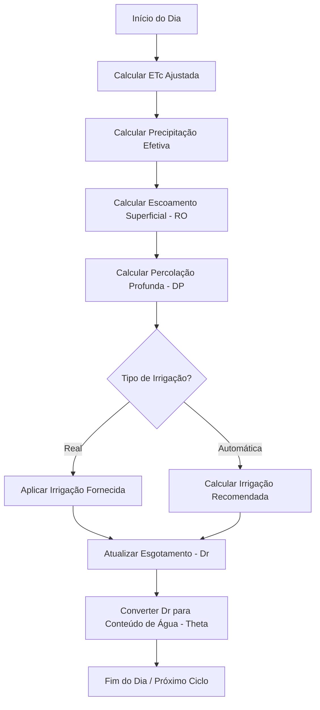

# Documentação de Lógica de Negócio - Balanço Hídrico (SWB)

Esta documentação descreve o funcionamento dos cálculos de balanço hídrico do solo implementados neste repositório, baseados na metodologia **FAO-56**.

## Visão Geral

O sistema simula o estado diário da água na zona radicular do solo. Ele contabiliza as entradas (chuva e irrigação) e saídas (evapotranspiração, escoamento superficial e percolação profunda) para determinar o esgotamento de água no solo.

## Fluxo Diário de Processamento

Abaixo, o diagrama que ilustra o ciclo de cálculo executado para cada dia na série temporal:

## Detalhes dos Cálculos

### 1. Parâmetros de Solo e Água

*   **Theta S (Saturação)**: Conteúdo de água quando todos os poros estão preenchidos.
*   **Theta FC (Capacidade de Campo)**: Água retida após a drenagem do excesso.
*   **Theta WP (Ponto de Murcha)**: Limite mínimo de água antes da planta murchar.
*   **TAW (Água Total Disponível)**: Água total que as raízes podem acessar.
    *   `TAW = (Theta_FC - Theta_WP) * Zr * Zr_factor`
*   **RAW (Água Prontamente Disponível)**: Fração da TAW que pode ser extraída sem estresse hídrico.
    *   `RAW = p * TAW`

### 2. Evapotranspiração da Cultura (ETc)

A evapotranspiração de referência ($ETo$) é multiplicada pelo coeficiente da cultura ($Kc$):
$ETc = ETo \times Kc$

Se o esgotamento atual ($Dr$) ultrapassar o $RAW$, aplica-se um coeficiente de estresse ($Ks$):
$Ks = \frac{TAW - Dr}{TAW - RAW} \quad (\text{limitado a 1.0})$
$ETc_{adj} = ETc \times Ks$

### 3. Precipitação Efetiva

Nem toda chuva é aproveitada pelo solo. O modelo segue a regra:
- Se $P \ge 0.2 \times ETo$: $P_{eff} = P \times 0.8$
- Caso contrário: $P_{eff} = 0$

### 4. Escoamento Superficial (Runoff - RO)

Ocorre quando a entrada de água excede a capacidade de saturação do solo:
$RO = \max(P_{eff} + (\theta_{prev} - \theta_s) \times Zr \times factor, 0)$

### 5. Percolação Profunda (DP)

Água que drena abaixo da zona radicular quando o solo excede a capacidade de campo:
$DP = \frac{\max(\text{Água em excesso}, 0)}{draintime}$

### 6. Lógica de Irrigação

O sistema possui dois modos principais:
- **Irrigação Real**: Usa valores históricos fornecidos.
- **Irrigação Automática**: Recomendada quando $Dr > RAW$. O cálculo utiliza o fator $MIF$ (Malamos Irrigation Factor):
  $Irrig_{rec} = Dr \times MIF$

### 7. Atualização do Esgotamento (Dr)

O esgotamento da zona radicular é atualizado diariamente:
$Dr_{novo} = Dr_{ant} - (P_{eff} - RO) + ETc_{adj} + DP - Irrig$

---

## Estrutura de Execução

O motor principal reside em `swb/swb.py`, na classe `SoilWaterBalance`. 

1.  **Inicialização**: Define os parâmetros de solo e planta.
2.  **Interpolação de Kc**: O $Kc$ é ajustado conforme o estágio de crescimento da planta (inicial, desenvolvimento, meio, fim).
3.  **Simulação**: Itera sobre a série temporal aplicando as fórmulas acima para manter o balanço de massa hídrica.
